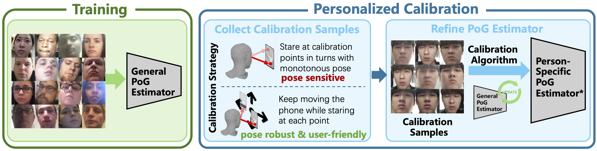

# Pose-Robust Calibration Strategy for Point-of-Gaze Estimation on Mobile Phones

<!--[Yujie Zhao](https://github.com/ZhaoYujie2002), [Jiabei Zeng](https://scholar.google.com/citations?user=N9elZDYAAAAJ&hl=zh-CN), [Shiguang Shan](https://scholar.google.com.hk/citations?user=Vkzd7MIAAAAJ&hl=en)<br>
-->
<div align="center">
  <p>
    <a href="https://github.com/ZhaoYujie2002">Yujie Zhao</a>,
    <a href="https://scholar.google.com/citations?user=N9elZDYAAAAJ&hl=zh-CN">Jiabei Zeng</a>,
    <a href="https://scholar.google.com.hk/citations?user=Vkzd7MIAAAAJ&hl=en">Shiguang Shan</a>
  </p>
</div>
<div align="center">
<!--
<a href="https://jytime.github.io/data/VGGT_CVPR25.pdf" target="_blank" rel="noopener noreferrer">
  
</a>
-->
<a href="">
  
</a>
<a href="https://mobile-pog.github.io/">
  
</a>
<a href="https://drive.google.com/drive/folders/1grBOkbJAagurywGrlmcRDuCQ0F-_1vAR?usp=sharing">
  
</a>
<a href="https://huggingface.co/datasets/HomieZ/MobilePoG">
    
</a>
</div>

<p align="center">
    
</p>

This repository contains the official authors implementation associated with the BMVC 2025 paper "Pose-Robust Calibration Strategy for Point-of-Gaze Estimation on Mobile Phones". We further provide the datasets and model weights. 

## Clone the Repository

```shell
# SSH
git clone git@github.com:ZhaoYujie2002/MobilePoG.git
```
or
```shell
# HTTPS
git clone https://github.com/ZhaoYujie2002/MobilePoG.git
```

## Environment Setup

Our default, provided install method is based on Conda package and environment management:

```shell
conda env create --file environment.yml
conda activate mobilepog
```

## Download Datasets and Model Weights  
We provide the MobilePoG dataset. You can download them from [here](https://huggingface.co/datasets/HomieZ/MobilePoG).

We provide the pretrained model weights on GazeCapture and MobilePoG. You can download them from [here](https://drive.google.com/drive/folders/1grBOkbJAagurywGrlmcRDuCQ0F-_1vAR?usp=sharing).

## Training
```shell
# modify .yaml file to train different models on different datasets
CUDA_VISIBLE_DEVICES=0,1,2,3 OMP_NUM_THREADS=1 python -m torch.distributed.launch --nproc_per_node=4 pretrain.py --config config/pretrain/config.yaml
```

## Calibration

**Command Line Arguments**

- **model_name:** The name of the base model. This repository now supports iTracker and AFFNet.

- **point_num:** The number of calibration points. Like 1, 4, 5...

- **pose_num:** The number of calibration poses for the Static-MobilePoG dataset. Like 1, 2, 3...

- **method:** The sample method of calibration frames for the Dynamic-MobilePoG dataset. This repository now supports Uniform and Continuous.


**Calibration Scripts**
- **SVR**

  ```shell
  python svr_smpg.py \
  	--config config/calibrate/svr_${model_name}_smpg.yaml \
  	--point_num ${point_num} \
  	--pose_num ${pose_num}
  
  python svr_dmpg.py \
  	--config config/calibrate/svr_${model_name}_dmpg.yaml \
  	--point_num ${point_num} \
  	--sample_method ${method}
  ```

- **Linear Probe**

  ```shell
  python linear_probe_smpg.py \
  	--config config/calibrate/lp_${model_name}_smpg.yaml \
  	--point_num ${point_num} \
  	--pose_num ${pose_num}
  
  python linear_probe_dmpg.py \
  	--config config/calibrate/lp_${model_name}_dmpg.yaml \
  	--point_num ${point_num} \
  	--sample_method ${method}
  ```

- **Finetune MLP**

  ```shell
  python finetune_mlp_smpg.py \
  	--config config/calibrate/fmlp_${model_name}_smpg.yaml \
  	--point_num ${point_num} \
  	--pose_num ${pose_num}
  
  python finetune_mlp_dmpg.py \
  	--config config/calibrate/fmlp_${model_name}_dmpg.yaml \
  	--point_num ${point_num} \
  	--sample_method ${method}
  ```

- **Full Finetune**

  ```shell
  python full_finetune_smpg.py \
  	--config config/calibrate/ff_${model_name}_smpg.yaml \
  	--point_num ${point_num} \
  	--pose_num ${pose_num}
  
  python full_finetune_dmpg.py \
  	--config config/calibrate/ff_${model_name}_dmpg.yaml \
  	--point_num ${point_num} \
  	--sample_method ${method}
  ```

<section class="section" id="BibTeX">
  <div class="container is-max-desktop content">
    <h2 class="title">BibTeX</h2>
    <pre><code>
    @misc{zhao2025poserobustcalibrationstrategypointofgaze,
      title={Pose-Robust Calibration Strategy for Point-of-Gaze Estimation on Mobile Phones}, 
      author={Yujie Zhao and Jiabei Zeng and Shiguang Shan},
      year={2025},
      eprint={2508.10268},
      archivePrefix={arXiv},
      primaryClass={cs.CV},
      url={https://arxiv.org/abs/2508.10268}, 
    }
    </code></pre>
  </div>
</section>
